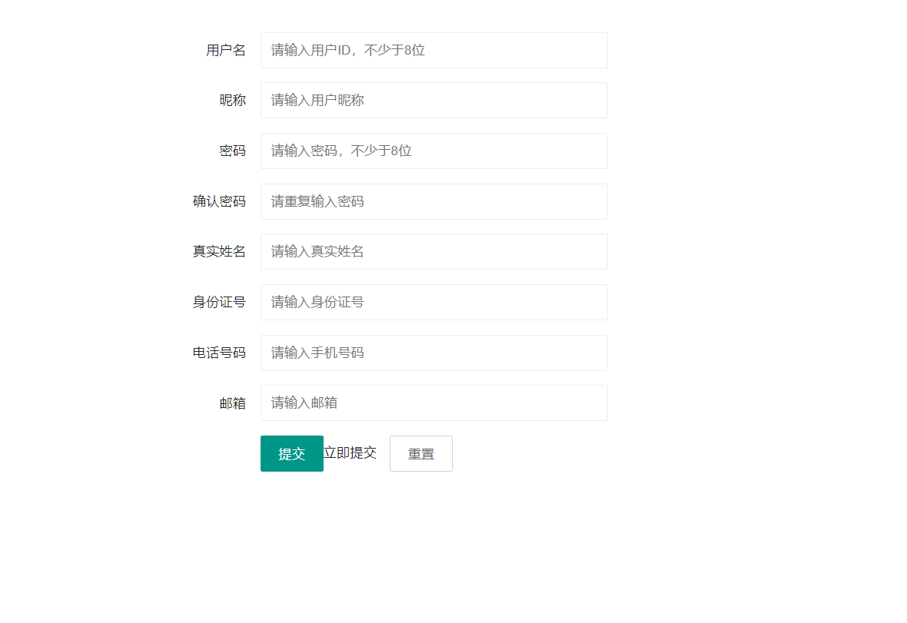
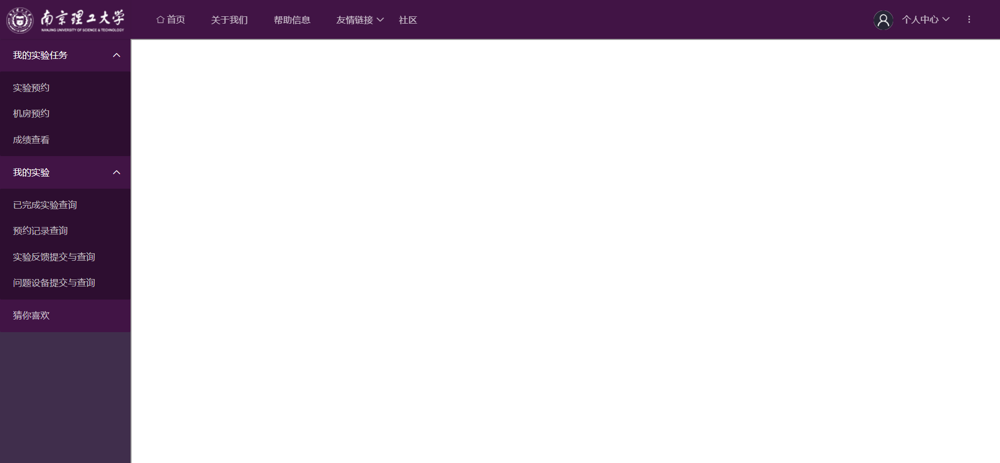
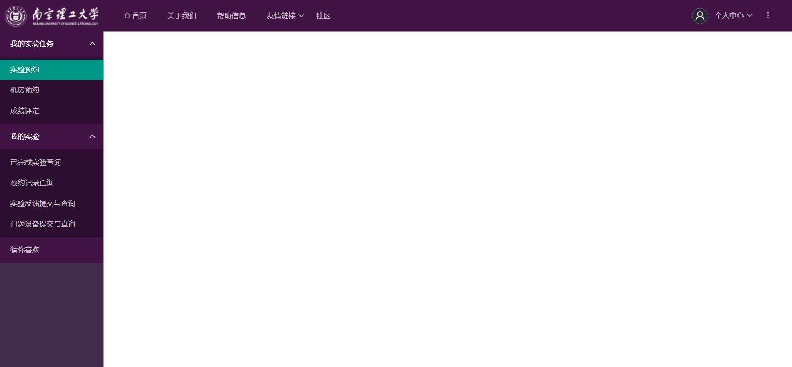
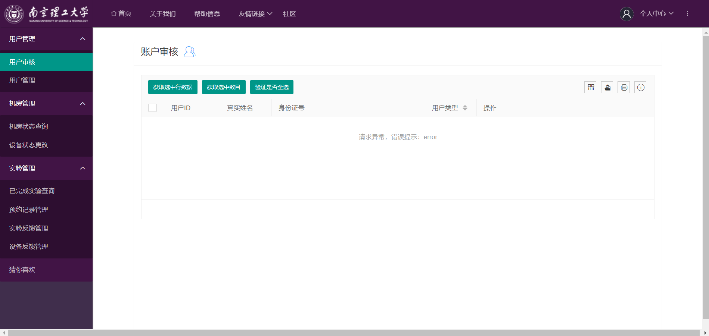
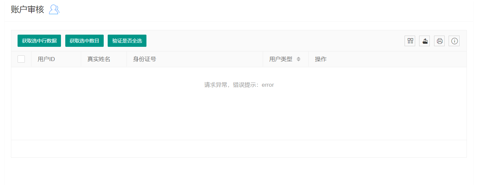
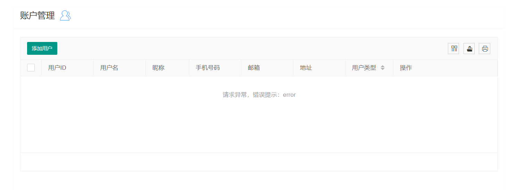
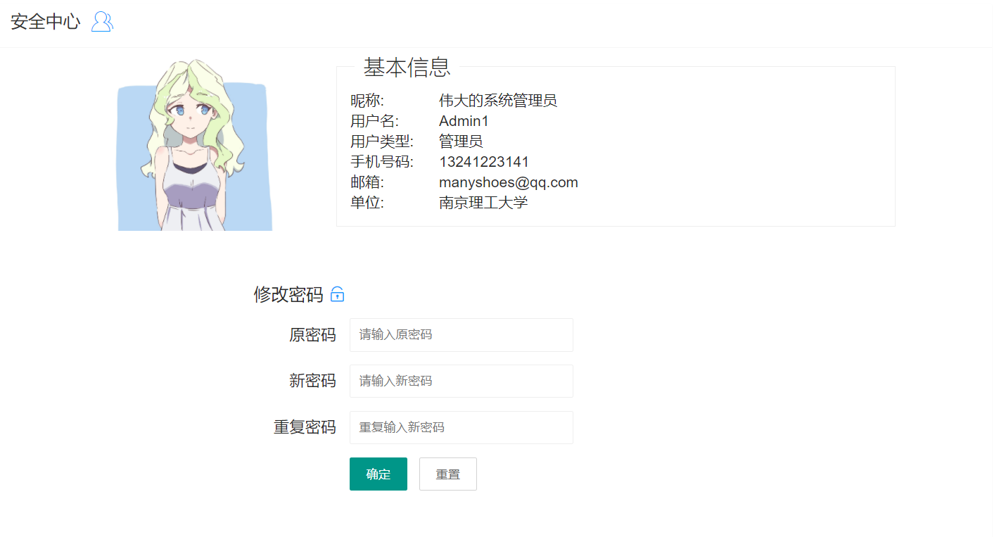
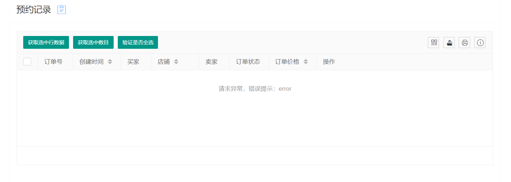
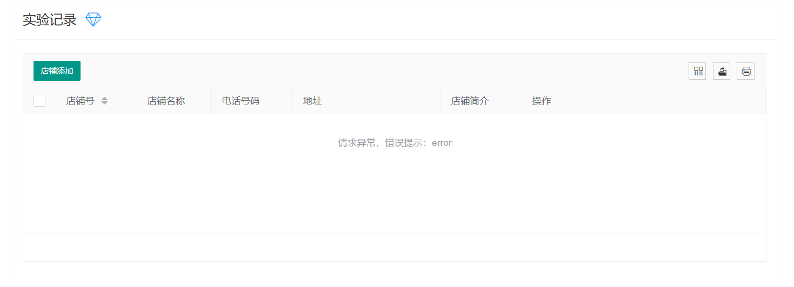
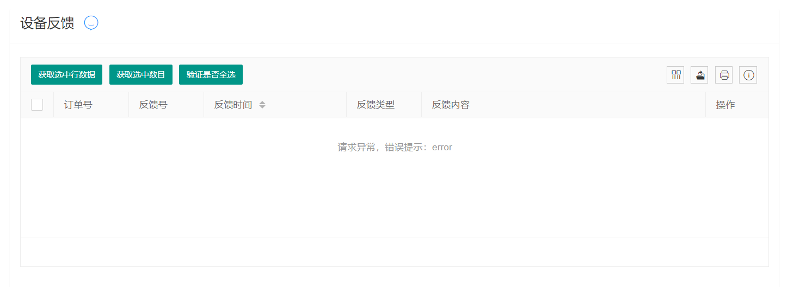

[TOC]

# 软件项目管理——实验室排课系统

## 后端

### 文档需更改内容

#### 实体类（数据库部分）

实体类依据需求规格说明书新建，可能存在不合理的地方，后期根据需要进行更改。**请将所有实体类与文档不相符的地方写在这里，以便后续文档的更改**↓：

1. 更正拼写错误：`machine`表中的`NUMBER_VAILD`字段改为`NUMBER_VALID`
2. 增加新字段：`machine`表增加`NUMBER_TOTAL`字段，类型同`NUMBER_VALID`字段 

#### 功能更改

1. 删除**4.2.2教师排课**中的“**教师可以将名单导入系统**”
2. 删除**4.2.6 管理员后台管理** 中的“**管理员可以向教师和学生发送消息**”

------

## 前端页面

### v1.1 更新内容

1. 更新了主页内容 index.html
2. 为三类用户（学生、教师、管理员）编写了三种前端，分别存放在admin/teacher/student三个文件夹中，请打开每个文件夹中的index.html查看主要页面，其中内容有待进一步完善。

### 页面展示

#### 登录页面

#### ~~注册界面~~

该项目不需要用户注册功能。

#### 学生页面

##### 首页

#### 教师页面

##### 首页

#### 管理员页面

##### 首页

##### 账户审核

##### 账户管理

#### 通用页面

##### 账户信息

##### 账户信息修改

##### 预约记录

##### 实验记录

##### 实验反馈

##### 设备反馈

