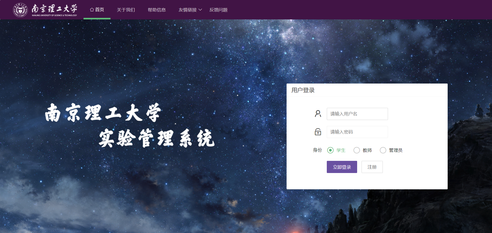
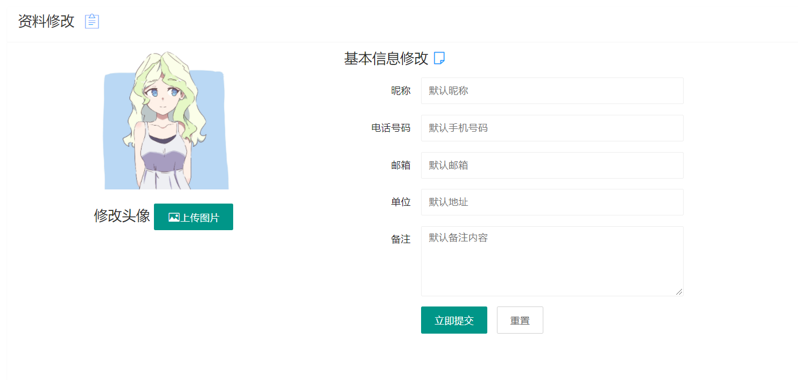

# 软件项目管理——实验室排课系统

## 后端

### 文档需更改内容

#### 实体类（数据库部分）

实体类依据需求规格说明书新建，可能存在不合理的地方，后期根据需要进行更改。**请将所有实体类与文档不相符的地方写在这里，以便后续文档的更改**↓：

##### Classroom表

1. 更正拼写错误：`NUMBER_VAILD`字段改为`NUMBER_VALID`
2. 增加新字段：增加`NUMBER_TOTAL`字段，类型同`NUMBER_VALID`字段 

##### Arrange表

1. 删除：`startTime`字段，`endTime`字段
2. 新增：`week`字段、`day`字段、`start`字段、`end`字段，分别对应周次、星期、开始节次、结束节次。类型为`INT`

##### Mag表（新增）

​	用于传递诸如机器保修信息、教师实验安排被管理员取消、学生选择的实验被教师取消等跨越用户的信息。在用户登录其首页时，查找该表获取系统消息。在用户阅读完消息后，删除对应的数据，避免重复提醒 。

1. `id`字段，`VARCHAR`类型，消息的id号
2. `message`字段，`VARCHAR`类型。用于存储具体的信息内容
3. `type`字段，`VARCHAR`类型。用于指定消息的发送对象(`Student/Admin/Teacher`)
4. `targetId`字段，`VARCHAR`类型。用于指定消息的发送对象的id

##### Machine表

1. 为保证程序正常运行，`condition`字段只应该存在**"正常"、"损坏"**。
2. 为保证程序正常运行，`machine_id`字段每个教室都应该**从1开始，顺序递增**。

#### 功能更改

1. 删除**4.2.2教师排课**中的“**教师可以将名单导入系统**”
2. 删除**4.2.6 管理员后台管理** 中的“**管理员可以向教师和学生发送消息**”

------

## 前端页面

### v1.1 更新内容

1. 更新了主页内容 index.html
2. 为三类用户（学生、教师、管理员）编写了三种前端，分别存放在admin/teacher/student三个文件夹中，请打开每个文件夹中的index.html查看主要页面，其中内容有待进一步完善。

### 页面展示

#### 登录页面

#### ~~注册界面~~

该项目不需要用户注册功能。

#### 学生页面

##### 首页

#### 教师页面

##### 首页

#### 管理员页面

##### 首页

##### 账户审核

##### 账户管理

#### 通用页面

##### 账户信息

##### 账户信息修改

##### 预约记录

##### 实验记录

##### 实验反馈

##### 设备反馈

